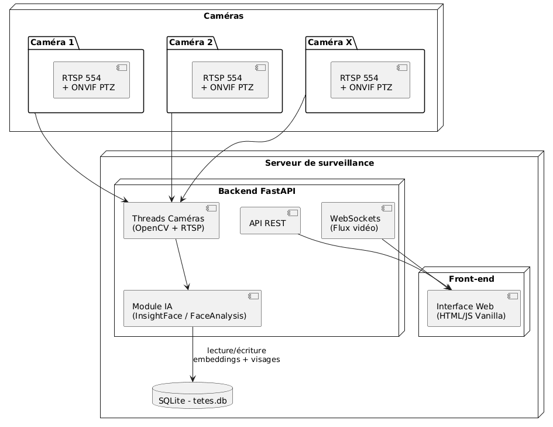

# Caméra IA

## Présentation

Ceci est un mini-projet où on utilise les [caméras Wansview 3MP Q5](https://www.wansview.com/q5) pour de la reconnaisance faciale.

## Architecture générale



## Fonctionnalités principales

### Détection des caméras sur le réseau

Je scan le réseau (`172.20.21.0/24`) et je vérifie si le port `554` est ouvert.

### Gestion du flux vidéo

-   Décodage du flux RTSP
-   Création d'un thread par caméra
-   Envoi des images en base64 avec WebSocket

### IA / InsightFace

-   Détection des visages frame par frame
-   Modèle utilisé : buffalo_sface
-   Comparaison avec les visages présents dans la base de données

### Rotation caméra avec ONVIF PTZ

-   Envoi de requête SOAP/XML
-   Contrôle des commandes (pan et tilt)

### Stockage

-   Base de SQLite : `tetes.db`
-   Images stockées au format `.jpg`

## Strucure du projet

```bash
Camera/
│
├── backend/
│   ├── serveur.py               # Serveur backend
│   ├── recuperationCameras.py   # Scan du réseau pour trouver les caméras
│   ├── bdd.py                   # Initialisation de la base de données
│   └── tetes.db                 # Fichier de base de données SQLite
│
└── frontend/
    ├── index.html               # Page d'accueil avec les flux vidéos sans IA
    ├── camera.html              # Page avec le flux vidéo avec l'IA
    ├── liste-visage.html        # Page pour modifier le nom des visages
    ├── scripts/                 # Script JavaScript
    ├── styles/                  # Styles des pages HTML
    └── img/                     # Images utiliser par le frontend

```

## Installation à partir de GitHub

### 1. Cloner le projet

```bash
git clone https://github.com/RandomElo/Camera.git
cd Camera
```

### 2. Autorise l’exécution de scripts locaux non signés

Powershell administrateur :

```bash
Set-ExecutionPolicy -ExecutionPolicy RemoteSigned -Scope CurrentUser
```

### 3. Mise en place de l'environnement Python

```bash
cd ./backend
py -3.10 -m venv venv
source venv/bin/activate  # Linux
venv\Scripts\activate     # Windows
```

### 4. Installation de buffalo_s

Télécharger [buffalo_s](https://github.com/deepinsight/insightface/releases/) et mettre le contenu dans le dossier `/models/buffalo_sface`.

### 5 . Installation compileur C++

Vérifier que compileur Microsoft Visual C++ existe bien dans le pc sinon l'installer ([lien](https://visualstudio.microsoft.com/visual-cpp-build-tools/)) et cocher la case `Desktop development with C++`

### 6. Installation des dépendences

```bash
pip install -r requirements.txt
```

### 7. Configuration des caméras Wansview

Une fois la caméra connecté sur le réseau grâce à l'application Wansview, il faut aller dans **Application Locale** puis :

-   Dans **Compte local** définir compte nom d'utilisateur et de mot de passe : `camera`
-   Dans **RTSP** activer le service et vérifier qu'il fonctionne sur le port : `554`
-   Dans **ONVIF** :
    -   Activer le service et vérifier qu'il fonctionne sur le port : `8899`
    -   Désactiver l'option **Vérification**

### 8. Démarrer le serveur backend

```bash
uvicorn serveur:app --reload
```

### 9. Accéder au frontend

Lien : [http://localhost:8000](http://localhost:8000)

## Installation à partir de Docker

⚠️ Par manque de temps lors de la réalisation, l'installation est uniquement possible via Github.

## API - Documentation

### GET /api/liste-cameras

-   Renvoie la liste des caméras détectées.

### POST /api/ajouter-visage

-   Enregistre un nouveau visage dans la base.

### GET /api/visages-enregistrer

-   Liste tous les visages connus.

### POST /api/modifier-nom

-   Modifie le nom associé à un visage.

### POST /api/bouger-camera

-   Commande PTZ ONVIF.

### WebSocket /ws/camera?ip=<CAM_IP>

Envoie :

-   image encodée base64
-   nombre de têtes détectées
-   liste des visages reconnues
-   bounding boxes dessinées côté serveur
